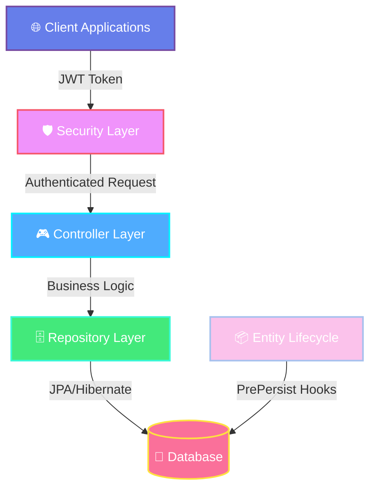

<div align="center">

# 🌐 LearnSphere Backend

### *Next-Generation Learning Management System*

[](https://openjdk.java.net/)
[](https://spring.io/projects/spring-boot)
[](https://jwt.io/)
[](LICENSE)

**A high-performance, secure, and scalable Learning Management System backend engineered for real-time academic tracking and seamless educational experiences.**

[Features](#-features) • [Architecture](#-architecture) • [Quick Start](#-quick-start) • [API Reference](#-api-reference) • [Documentation](#-documentation)

---

</div>

## 🎯 Overview

LearnSphere Backend is a robust, enterprise-grade LMS platform built with modern Java technologies. Designed with **minimalist architecture** and **zero-compromise security**, it powers educational institutions with real-time course management, automated assessments, and dynamic student engagement tools.

### 🏆 What Makes LearnSphere Special?

```text
🚀 Blazing Fast        →  Optimized architecture with minimal latency
🔐 Fort Knox Security  →  Stateless JWT + Role-based access control
📊 Real-Time Analytics →  Dynamic leaderboards and progress tracking
🎓 Complete LMS Suite  →  Courses, Tests, Forums, Feedback - all integrated
🔄 Auto-Magic Features →  Entity lifecycle hooks for consistent data management
```

---

## ✨ Features

<div align="center">

| Feature | Description |
|---------|-------------|
| 🔐 **Stateless Authentication** | JWT-based security with role-based access (Student/Instructor/Admin) |
| 🏫 **Department Hierarchy** | Organized academic structure for courses and users |
| 📚 **Course Management** | Complete CRUD operations with module and content organization |
| 📝 **Smart Assessments** | Automated testing engine with MCQ, Text, and True/False questions |
| 📊 **Dynamic Leaderboards** | Real-time global and departmental ranking system |
| 💬 **Discussion Forums** | Hierarchical threads for student-instructor collaboration |
| 🎯 **Progress Tracking** | Enrollment management with detailed progress monitoring |
| ⭐ **Feedback System** | Course ratings and reviews for continuous improvement |
| 🔄 **Lifecycle Automation** | `@PrePersist` hooks for timestamps and status management |

</div>

---

## 🏗 Architecture

LearnSphere follows a **clean, minimalist architecture** designed for maximum performance and maintainability.



### 📁 Project Structure

```text
com.learnsphere.backend/
│
├── 🎮 controller/          # REST API Endpoints
│   ├── AuthController      # Authentication & Authorization
│   ├── CourseController    # Course Management
│   ├── TestController      # Assessment Engine
│   └── ...
│
├── 📦 entity/              # JPA Database Models
│   ├── User                # User entities with roles
│   ├── Course              # Course structure
│   ├── Test                # Assessment models
│   └── ...
│
├── 🗄️ repository/          # Data Access Layer
│   ├── UserRepository
│   ├── CourseRepository
│   └── ...
│
└── 🛡️ security/            # Security Configuration
    ├── JwtAuthFilter       # JWT Token validation
    ├── SecurityConfig      # Spring Security setup
    └── ...
```

---

## 🛠 Tech Stack

<div align="center">

### Core Technologies


### Libraries & Tools


</div>

---

## 🚀 Quick Start

### Prerequisites

Before you begin, ensure you have the following installed:

- ☕ **JDK 21** or higher
- 📦 **Maven 3.x**
- 🗄️ **PostgreSQL** (or your preferred database)

### Installation

1️⃣ **Clone the repository**

```bash
git clone https://github.com/Chetanyadav1606/LearnSphere-Backend.git
cd LearnSphere-Backend
```

2️⃣ **Configure Database**

Update `src/main/resources/application.properties`:

```properties
# Database Configuration
spring.datasource.url=jdbc:postgresql://localhost:3306/learnsphere
spring.datasource.username=your_username
spring.datasource.password=your_password

# JPA Configuration
spring.jpa.hibernate.ddl-auto=update
spring.jpa.show-sql=true
spring.jpa.properties.hibernate.format_sql=true
```

3️⃣ **Build the project**

```bash
mvn clean install
```

4️⃣ **Run the application**

```bash
mvn spring-boot:run
```

5️⃣ **Verify installation**

The server will start on `http://localhost:8080`

```bash
curl http://localhost:8080/actuator/health
```

---

## 🔌 API Reference

> **Authentication Required:** All endpoints (except Auth) require `Authorization: Bearer <token>` header.

### 🔐 Authentication

<details>
<summary><b>Click to expand Authentication endpoints</b></summary>

#### Register User
```http
POST /api/auth/register
```

**Request Body:**
```json
{
  "fullName": "John Doe",
  "email": "john@example.com",
  "password": "SecurePass123",
  "role": "STUDENT"
}
```

**Response:**
```json
{
  "userId": 1,
  "fullName": "John Doe",
  "email": "john@example.com",
  "role": "STUDENT",
  "createdAt": "2024-01-15T10:30:00"
}
```

---

#### Login
```http
POST /api/auth/login
```

**Request Body:**
```json
{
  "email": "john@example.com",
  "password": "SecurePass123"
}
```

**Response:**
```text
eyJhbGciOiJIUzI1NiIsInR5cCI6IkpXVCJ9.eyJzdWIiOiIxMjM0NTY3ODkwIiwibmFtZSI6IkpvaG4gRG9lIiwiaWF0IjoxNTE2MjM5MDIyfQ...
```
*Returns raw JWT token string*

</details>

---

### 🏫 Department Management

<details>
<summary><b>Click to expand Department endpoints</b></summary>

#### Create Department
```http
POST /api/departments
Authorization: Bearer <token>
```

**Request Body:**
```json
{
  "name": "Computer Science"
}
```

**Response:**
```json
{
  "departmentId": 1,
  "name": "Computer Science",
  "createdAt": "2024-01-15T10:30:00"
}
```

</details>

---

### 👥 User Management

<details>
<summary><b>Click to expand User endpoints</b></summary>

#### Get All Users (Admin)
```http
GET /api/users
Authorization: Bearer <admin-token>
```

#### Get User by ID
```http
GET /api/users/{id}
Authorization: Bearer <token>
```

#### Create User (Admin)
```http
POST /api/users
Authorization: Bearer <admin-token>
```

</details>

---

### 📚 Course Management

<details>
<summary><b>Click to expand Course endpoints</b></summary>

#### Create Course
```http
POST /api/courses
Authorization: Bearer <instructor-token>
```

**Request Body:**
```json
{
  "title": "Introduction to Java Programming",
  "description": "Learn Java from scratch",
  "department": {
    "departmentId": 2
  },
  "creator": {
    "userId": 5
  }
}
```

**Response:**
```json
{
  "courseId": 1,
  "title": "Introduction to Java Programming",
  "description": "Learn Java from scratch",
  "department": {
    "departmentId": 2,
    "name": "Computer Science"
  },
  "creator": {
    "userId": 5,
    "fullName": "Prof. Jane Smith"
  },
  "createdAt": "2024-01-15T10:30:00"
}
```

---

#### Get All Courses
```http
GET /api/courses
Authorization: Bearer <token>
```

---

#### Get Published Courses
```http
GET /api/courses/published
Authorization: Bearer <token>
```

</details>

---

### 📖 Content Management

<details>
<summary><b>Click to expand Content endpoints</b></summary>

#### Create Module
```http
POST /api/content/module
Authorization: Bearer <instructor-token>
```

**Request Body:**
```json
{
  "course": {
    "courseId": 1
  },
  "title": "Getting Started with Java",
  "position": 1
}
```

**Response:**
```json
{
  "moduleId": 1,
  "course": {
    "courseId": 1,
    "title": "Introduction to Java Programming"
  },
  "title": "Getting Started with Java",
  "position": 1,
  "createdAt": "2024-01-15T10:30:00"
}
```

---

#### Get Course Modules
```http
GET /api/content/module/course/{courseId}
Authorization: Bearer <token>
```

---

#### Add Content Item
```http
POST /api/content/item
Authorization: Bearer <instructor-token>
```

**Request Body:**
```json
{
  "module": {
    "moduleId": 3
  },
  "contentType": "VIDEO",
  "title": "Variables and Data Types",
  "filePath": "courses/java/module1/variables.mp4",
  "durationSeconds": 600,
  "position": 1
}
```

**Response:**
```json
{
  "contentItemId": 1,
  "module": {
    "moduleId": 3,
    "title": "Getting Started with Java"
  },
  "contentType": "VIDEO",
  "title": "Variables and Data Types",
  "filePath": "courses/java/module1/variables.mp4",
  "durationSeconds": 600,
  "position": 1,
  "createdAt": "2024-01-15T10:30:00"
}
```

*Note: `contentType` can be: VIDEO, PDF, or QUIZ*

</details>

---

### ✍️ Enrollment & Progress

<details>
<summary><b>Click to expand Enrollment endpoints</b></summary>

#### Enroll in Course
```http
POST /api/enrollments
Authorization: Bearer <student-token>
```

**Request Body:**
```json
{
  "user": {
    "userId": 10
  },
  "course": {
    "courseId": 1
  },
  "role": "STUDENT"
}
```

**Response:**
```json
{
  "enrollmentId": 1,
  "user": {
    "userId": 10,
    "fullName": "John Doe"
  },
  "course": {
    "courseId": 1,
    "title": "Introduction to Java Programming"
  },
  "role": "STUDENT",
  "enrolledAt": "2024-01-15T10:30:00",
  "progress": 0.0
}
```

*Note: `enrolledAt` is automatically set via @PrePersist hook*

---

#### Get User Enrollments
```http
GET /api/enrollments/user/{userId}
Authorization: Bearer <token>
```

---

#### Get Course Enrollments
```http
GET /api/enrollments/course/{courseId}
Authorization: Bearer <token>
```

</details>

---

### 📝 Assessment Engine

<details>
<summary><b>Click to expand Test endpoints</b></summary>

#### Create Test
```http
POST /api/tests
Authorization: Bearer <instructor-token>
```

**Request Body:**
```json
{
  "course": {
    "courseId": 1
  },
  "title": "Java Basics Quiz",
  "durationMinutes": 60,
  "scheduledAt": "2024-01-20T14:00:00"
}
```

**Response:**
```json
{
  "testId": 1,
  "course": {
    "courseId": 1,
    "title": "Introduction to Java Programming"
  },
  "title": "Java Basics Quiz",
  "durationMinutes": 60,
  "scheduledAt": "2024-01-20T14:00:00",
  "createdAt": "2024-01-15T10:30:00"
}
```

---

#### Add Question
```http
POST /api/tests/question
Authorization: Bearer <instructor-token>
```

**Request Body (MCQ):**
```json
{
  "test": {
    "testId": 1
  },
  "body": "What is the size of int in Java?",
  "questionType": "MCQ",
  "marks": 5,
  "correctAnswer": "4 bytes",
  "extra": {
    "options": ["2 bytes", "4 bytes", "8 bytes", "16 bytes"]
  }
}
```

**Request Body (Text):**
```json
{
  "test": {
    "testId": 1
  },
  "body": "Explain the concept of inheritance in Java.",
  "questionType": "TEXT",
  "marks": 10,
  "correctAnswer": "Sample answer for evaluation"
}
```

**Response:**
```json
{
  "questionId": 1,
  "test": {
    "testId": 1,
    "title": "Java Basics Quiz"
  },
  "body": "What is the size of int in Java?",
  "questionType": "MCQ",
  "marks": 5,
  "correctAnswer": "4 bytes",
  "extra": {
    "options": ["2 bytes", "4 bytes", "8 bytes", "16 bytes"]
  },
  "createdAt": "2024-01-15T10:30:00"
}
```

*Note: `questionType` can be: MCQ, TEXT, or TRUE_FALSE*

---

#### Start Test Attempt
```http
POST /api/tests/attempt
Authorization: Bearer <student-token>
```

**Request Body:**
```json
{
  "test": {
    "testId": 1
  },
  "user": {
    "userId": 10
  }
}
```

**Response:**
```json
{
  "attemptId": 1,
  "test": {
    "testId": 1,
    "title": "Java Basics Quiz"
  },
  "user": {
    "userId": 10,
    "fullName": "John Doe"
  },
  "status": "IN_PROGRESS",
  "startedAt": "2024-01-15T10:30:00",
  "score": null
}
```

*Note: Status is automatically set to IN_PROGRESS, and startedAt is handled by @PrePersist*

---

#### Submit Answer
```http
POST /api/tests/answer
Authorization: Bearer <student-token>
```

---

#### Submit Test
```http
PUT /api/tests/attempt/{attemptId}/submit
Authorization: Bearer <student-token>
```

</details>

---

### 💬 Discussion Forums

<details>
<summary><b>Click to expand Discussion endpoints</b></summary>

#### Create Thread
```http
POST /api/discussions/thread
Authorization: Bearer <token>
```

**Request Body:**
```json
{
  "course": {
    "courseId": 1
  },
  "user": {
    "userId": 10
  },
  "title": "Doubts about Inheritance",
  "content": "Can someone explain method overriding?"
}
```

**Response:**
```json
{
  "threadId": 1,
  "course": {
    "courseId": 1,
    "title": "Introduction to Java Programming"
  },
  "user": {
    "userId": 10,
    "fullName": "John Doe"
  },
  "title": "Doubts about Inheritance",
  "content": "Can someone explain method overriding?",
  "createdAt": "2024-01-15T10:30:00"
}
```

---

#### Get Course Threads
```http
GET /api/discussions/course/{courseId}
Authorization: Bearer <token>
```

---

#### Add Post/Reply
```http
POST /api/discussions/post
Authorization: Bearer <token>
```

**Request Body (New Post):**
```json
{
  "thread": {
    "threadId": 1
  },
  "user": {
    "userId": 5
  },
  "body": "Method overriding occurs when a subclass provides its own implementation..."
}
```

**Request Body (Reply to Post):**
```json
{
  "thread": {
    "threadId": 1
  },
  "user": {
    "userId": 12
  },
  "body": "Thanks for the explanation! Can you give an example?",
  "parentPost": {
    "postId": 3
  }
}
```

**Response:**
```json
{
  "postId": 3,
  "thread": {
    "threadId": 1,
    "title": "Doubts about Inheritance"
  },
  "user": {
    "userId": 5,
    "fullName": "Prof. Jane Smith"
  },
  "body": "Method overriding occurs when a subclass provides its own implementation...",
  "parentPost": null,
  "createdAt": "2024-01-15T10:35:00"
}
```

---

#### Get Thread Posts
```http
GET /api/discussions/thread/{threadId}/posts
Authorization: Bearer <token>
```

</details>

---

### ⭐ Feedback System

<details>
<summary><b>Click to expand Feedback endpoints</b></summary>

#### Submit Feedback
```http
POST /api/feedback
Authorization: Bearer <student-token>
```

**Request Body:**
```json
{
  "user": {
    "userId": 10
  },
  "course": {
    "courseId": 1
  },
  "rating": 5,
  "message": "Excellent course! Very informative and well-structured."
}
```

**Response:**
```json
{
  "feedbackId": 1,
  "user": {
    "userId": 10,
    "fullName": "John Doe"
  },
  "course": {
    "courseId": 1,
    "title": "Introduction to Java Programming"
  },
  "rating": 5,
  "message": "Excellent course! Very informative and well-structured.",
  "createdAt": "2024-01-15T10:30:00"
}
```

*Note: `rating` is a Short type (numeric value)*

---

#### Get Course Feedback
```http
GET /api/feedback/course/{courseId}
Authorization: Bearer <token>
```

</details>

---

## 📊 API Response Formats

### Success Response
```json
{
  "status": "success",
  "data": { ... },
  "message": "Operation completed successfully"
}
```

### Error Response
```json
{
  "status": "error",
  "error": {
    "code": "AUTH_001",
    "message": "Invalid credentials"
  },
  "timestamp": "2024-01-15T10:30:00Z"
}
```

---

## 🔒 Security

LearnSphere implements **enterprise-grade security** practices:

- 🛡️ **JWT Authentication:** Stateless token-based auth with role validation
- 🔐 **Password Encryption:** BCrypt hashing for secure password storage
- 🚪 **Role-Based Access:** Granular permissions for Student/Instructor/Admin

---

## 🧪 Testing

Run the test suite:

```bash
# Run all tests
mvn test

# Run specific test class
mvn test -Dtest=CourseControllerTest

# Run with coverage
mvn clean test jacoco:report
```
---

## 🤝 Contributing

We welcome contributions! Here's how you can help:

1. 🍴 Fork the repository
2. 🌿 Create a feature branch (`git checkout -b feature/AmazingFeature`)
3. 💾 Commit your changes (`git commit -m 'Add some AmazingFeature'`)
4. 📤 Push to the branch (`git push origin feature/AmazingFeature`)
5. 🔃 Open a Pull Request

### Development Guidelines

- Follow Java coding conventions
- Write unit tests for new features
- Update documentation for API changes
- Use meaningful commit messages

---

## 👨‍💻 Developer

<div align="center">

### **Chetan Yadav**
*Lead Architect & System Developer*

[](https://github.com/Chetanyadav1606)
</div>

---

## 🙏 Acknowledgments

- Spring Framework Team for the excellent framework
- Hibernate Team for robust ORM capabilities
- The open-source community for inspiration and support

---
<div align="center">

### ⭐ Star this repository if you find it helpful!

**Made with ❤️ by Chetan Yadav**

*Building the future of education, one commit at a time.*

---
</div>
